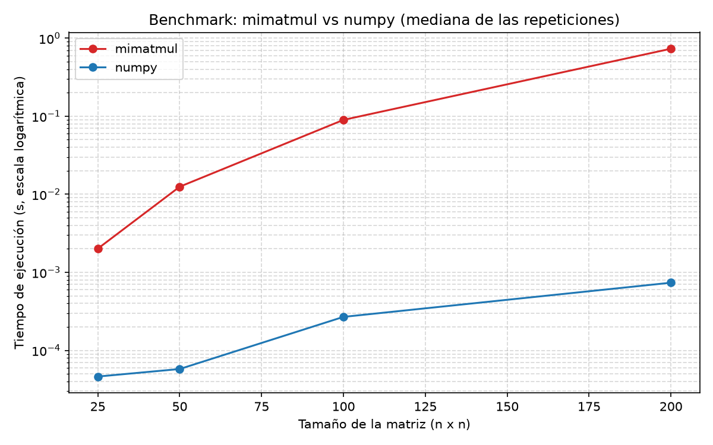

# P0-Caceres-JuanPablo

Proyecto 0: introducción al benchmarking y al trabajo con agentes de IA.

## Descripción

El proyecto implementa una multiplicación de matrices propia (`mimatmul`)
usando ciclos explícitos de Python y la compara con la operación optimizada
de NumPy (`A @ B`) para matrices cuadradas de distinto tamaño. Además:

- recopila información del computador (`src/system_info.py`);
- mide tiempos de ejecución con repeticiones y calentamiento
  (`src/benchmark.py`);
- guarda los resultados en CSV y genera un gráfico;
- observa el uso de CPU, RAM y GPU durante la ejecución.

El objetivo no es implementar una multiplicación eficiente, sino construir una
versión sencilla, reproducible y comparable contra una biblioteca numérica
optimizada, trabajando con el agente de programación OpenCode.

## Instalación

Requisitos: Python 3.14+, Git y un editor de código.

Crear el ambiente virtual:

```
python -m venv .venv
```

Activarlo en Windows con PowerShell:

```
.\.venv\Scripts\Activate.ps1
```

Activarlo en Windows con cmd:

```
.venv\Scripts\activate.bat
```

Instalar las dependencias:

```
pip install -r requirements.txt
```

Dependencias: `numpy`, `matplotlib`, `pytest`, `psutil`.

## Ejecución

Ejecutar las pruebas automáticas:

```
pytest
```

Ejecutar el benchmark (genera `data/benchmark_results.csv`,
`data/recursos_durante_benchmark.csv` y `figures/benchmark.png`):

```
python src/benchmark.py
```

Regenerar la información del computador:

```
python src/system_info.py
```

## Computador

Equipo evaluado (generado con `src/system_info.py`, ver
`data/system_info.json`):

| Característica | Valor |
|---|---|
| Sistema operativo | Windows 11 Home Single Language (64 bits) |
| Arquitectura | AMD64 |
| Procesador | Intel(R) Core(TM) i5-9300H CPU @ 2.40GHz |
| Núcleos físicos | 4 |
| Procesadores lógicos | 8 |
| Memoria RAM total | 7.84 GB |
| Memoria RAM disponible (durante el benchmark) | ~0.75–0.9 GB |
| GPU | Intel UHD Graphics 630 + NVIDIA GeForce GTX 1650 |
| Disco principal | C: — 930.39 GB total, 210.03 GB libres |
| Python | 3.14.7 |
| NumPy | 2.5.1 |

Nota: durante la ejecución el equipo estaba muy cargado (≈88 % de RAM en uso),
por lo que la memoria disponible era baja. Por eso el benchmark usa tamaños de
matriz moderados.

## Resultados

Gráfico del benchmark (promedio de 5 repeticiones por tamaño, escala
logarítmica en el eje Y):



Tiempos promedio observados (segundos):

| Tamaño | mimatmul | numpy | Diferencia |
|---|---|---|---|
| 25 | 0.0015 | 0.00006 | ~25× |
| 50 | 0.0104 | 0.00004 | ~260× |
| 100 | 0.0821 | 0.00022 | ~370× |
| 200 | 0.7624 | 0.00047 | ~1600× |

Observaciones durante una ejecución representativa:

- **CPU**: promedio 23.8 %, máximo 35.7 %.
- **RAM**: promedio 88.1 %, máximo 88.4 %.
- **GPU**: 0 % durante todo el benchmark.

### Comentario sobre el comportamiento observado

- `mimatmul` usa **un solo núcleo**: es un bucle triple de Python puro y no
  paraleliza. El uso de CPU observado (~24–36 % de un sistema de 8 hilos)
  corresponde aproximadamente a un núcleo físico ocupado, coherente con un
  proceso de un solo hilo.
- NumPy ejecuta la multiplicación en **código C compilado y vectorizado**
  (BLAS optimizado), sin pasar por el intérprete de Python para cada operación
  individual. Por eso es mucho más rápido y, para tamaños pequeños, el costo
  de llamada domina.
- Las **repeticiones no dan exactamente el mismo tiempo** porque el sistema
  operativo intercala otros procesos, la memoria disponible cambia (este equipo
  estaba al 88 % de RAM) y las posiciones en caché varían.
- La **memoria limita el benchmark**: NumPy usa 8 bytes por elemento
  (`n × n × 8` bytes) y `mimatmul` usa listas de Python, mucho más pesadas por
  elemento. Con solo ~0.9 GB disponibles, tamaños grandes (p. ej. n > 1000 en
  NumPy o n > 300 en listas de Python) saturarían la RAM y congelarían el
  equipo.
- Tener una **GPU no implica que el programa la use**: tanto `mimatmul` como
  `numpy` se ejecutan en la CPU. Para usar la GPU hay que mover explícitamente
  los datos hacia ella (p. ej. con CuPy o PyTorch). Por eso `nvidia-smi`
  reportó 0 % de utilización durante todo el benchmark.

## Uso de OpenCode

Este proyecto se desarrolló usando OpenCode como agente de programación. El
agente recibió el enunciado completo y ejecutó de forma autónoma el plan de
acción de `PENDIENTES.md`.

- **Qué hizo correctamente el agente**: instaló y verificó Git, creó el
  ambiente virtual con las dependencias, ejecutó `pytest` antes de cada avance,
  regeneró `data/system_info.json` con los datos reales de este computador
  (el archivo que existía era de otra máquina), completó las pruebas que
  faltaban (matrices rectangulares y comparación con NumPy), diseñó el
  benchmark con calentamiento, repeticiones y monitoreo de recursos, y
  mantuvo un historial Git incremental con commits claros.
- **Qué tuvo que corregirse**: el primer benchmark usaba tamaños tan pequeños
  que terminaba en menos de un segundo y el monitoreo de CPU no alcanzaba a
  registrar actividad; se corrigió aumentando los tamaños a `[25, 50, 100,
  200]` y ajustando el monitor para que la primera lectura de CPU no fuera 0.
  También se corrigió el calentamiento para que NumPy ejecutara `A @ B` y no
  `mimatmul`.
- **Qué parte comprendo mejor**: la implementación de `mimatmul` (triple bucle
  sobre las dimensiones) y la lógica del benchmark (calentamiento,
  `time.perf_counter`, repeticiones, guardado en CSV y gráfico).
- **Qué parte sigue siendo menos clara**: la interpretación fina del uso de CPU
  por método (el monitor captura el sistema completo, no un proceso aislado) y
  los detalles de por qué el costo de llamada de NumPy domina en tamaños
  pequeños.

> Nota: esta reflexión debe ser revisada y ajustada por el estudiante para que
> refleje su propio proceso y comprensión.

## Estado

P0E1 entregada. P0E2 completada: benchmark, datos, gráfico y documentación.
Ver `PENDIENTES.md` para el detalle del plan de acción y el estado final.
